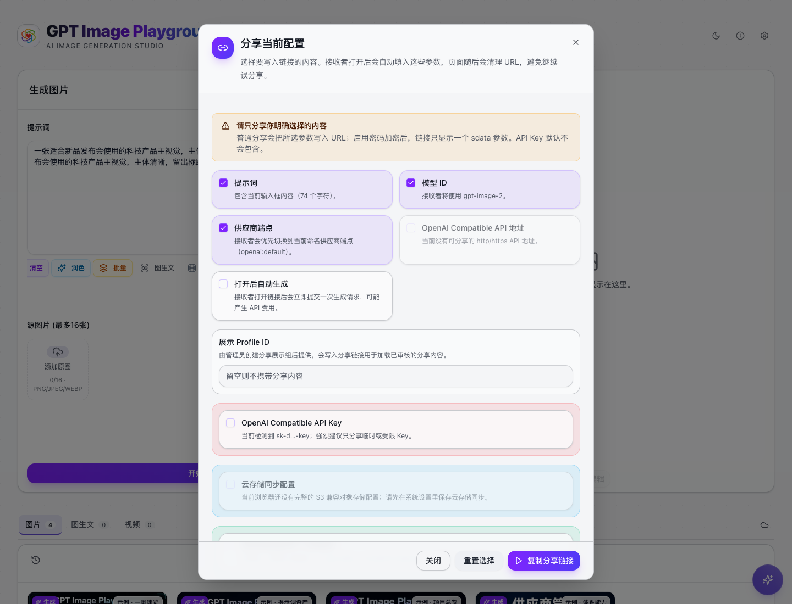

#  GPT Image Playground

GPT Image Playground 是一个面向创作者、运营、设计师和产品团队的 AI 图像工作台。它不只是一个文生图页面，而是把图片生成、图片编辑、提示词资产、历史资产、多供应商模型、分享协作和跨设备同步组织在同一个可持续使用的工作流里。


## 它解决什么问题

当你需要反复产出商品图、封面图、活动 KV、风格稿、角色设定、社媒素材或参考图编辑时，单次生成页面很快会变得不够用。这个项目把常用能力做成一个完整工作台：

- **从文字生成图片**：输入提示词，选择模型、数量、尺寸、质量和输出格式。
- **用参考图继续编辑**：上传、拖入、粘贴或从历史发送图片到编辑区，继续改图、换风格、做局部调整。
- **管理提示词资产**：内置多行业模板库，支持 `/` 快速搜索、提示词历史、一键润色、自定义模板、导入导出。
- **管理生成资产**：历史面板记录图片、模型、参数、耗时、提示词、费用估算和多图结果，支持预览、下载、多选和继续编辑。
- **连接多个模型供应商**：内置 OpenAI Compatible、Google Gemini、Seedream、SenseNova，也可以为同一供应商保存多个命名端点。
- **把工作流分享给别人或自己的新设备**：分享提示词、模型、端点配置，支持密码加密链接；Web 端还可以按环境变量对分享页做 DevTools 抑制，进一步降低 key 被直接拷走的风险；也支持通过 S3 兼容对象存储同步配置、提示词、历史和图片。
- **本地、Web、桌面多种使用方式**：可自托管、Vercel 部署，也可构建 Tauri 桌面应用。

## 适合谁使用

- **内容运营**：批量做小红书封面、短视频封面、节日物料、活动预告图。
- **电商团队**：生成商品主图、场景图、卖点图、材质细节图、套装陈列图。
- **设计师与品牌团队**：快速探索 KV、海报、包装方向、风格迁移和提案视觉。
- **游戏与创意团队**：制作角色、道具、场景、卡牌和世界观概念图。
- **开发者和自托管用户**：把多个兼容端点、模型能力、存储和同步集中配置。

## 快速上手

1. 打开应用，点击右上角 **Settings**。
2. 在 **供应商 API 配置** 中填入你要使用的 API Key 和 Base URL。只使用官方 OpenAI 时，Base URL 可以留空。
3. 回到主界面，在提示词框输入需求，或点击 **提示词模板** 从模板库选择。
4. 点击 **高级** 选择供应商、模型、尺寸、质量、输出格式等参数。
5. 点击 **开始生成**。结果会显示在输出区，并自动进入右侧历史。
6. 需要继续改图时，点击图片上的 **编辑**，或在历史预览中发送到编辑区。

详细步骤请阅读 [快速开始](./docs/getting-started.md)。

## 文档入口

这次文档已经拆成用户手册体系，根 README 只保留概要。按你的使用场景阅读：

- [文档首页](./docs/README.md)：所有用户手册入口。
- [快速开始](./docs/getting-started.md)：第一次打开应用时应该怎么配置和生成第一张图。
- [工作台界面说明](./docs/workspace.md)：主界面、输出区、历史区、全屏预览、拖拽粘贴和任务队列。
- [生成与编辑图片](./docs/generation-editing.md)：文生图、参考图编辑、蒙版、流式预览、Seedream/SenseNova 等高级参数。
- [提示词工作流](./docs/prompt-workflow.md)：模板库、`/` 搜索、历史、一键润色、自定义模板。
- [历史与资产管理](./docs/history-and-assets.md)：查看、下载、多选、费用、继续编辑和存储模式。
- [供应商与系统设置](./docs/providers-and-settings.md)：多供应商端点、自定义模型、运行参数、密码和桌面端设置。
- [分享与云同步](./docs/sharing-and-sync.md)：普通分享、加密分享、S3 兼容对象存储同步与恢复。
- [安装、部署与桌面端](./docs/desktop-and-deployment.md)：本地运行、Vercel、自托管、Tauri 桌面应用和常用环境变量。

## 界面预览

| 提示词模板库 | 高级选项 |
| --- | --- |
|  |  |

| 供应商设置 | 分享链接 |
| --- | --- |
|  |  |

## 本地运行

```bash
npm install
npm run dev
```

然后访问 <http://localhost:3000>。

Node.js 需要 20 或更高版本。更多部署、桌面端打包和环境变量说明见 [安装、部署与桌面端](./docs/desktop-and-deployment.md)。

## 许可证

MIT
