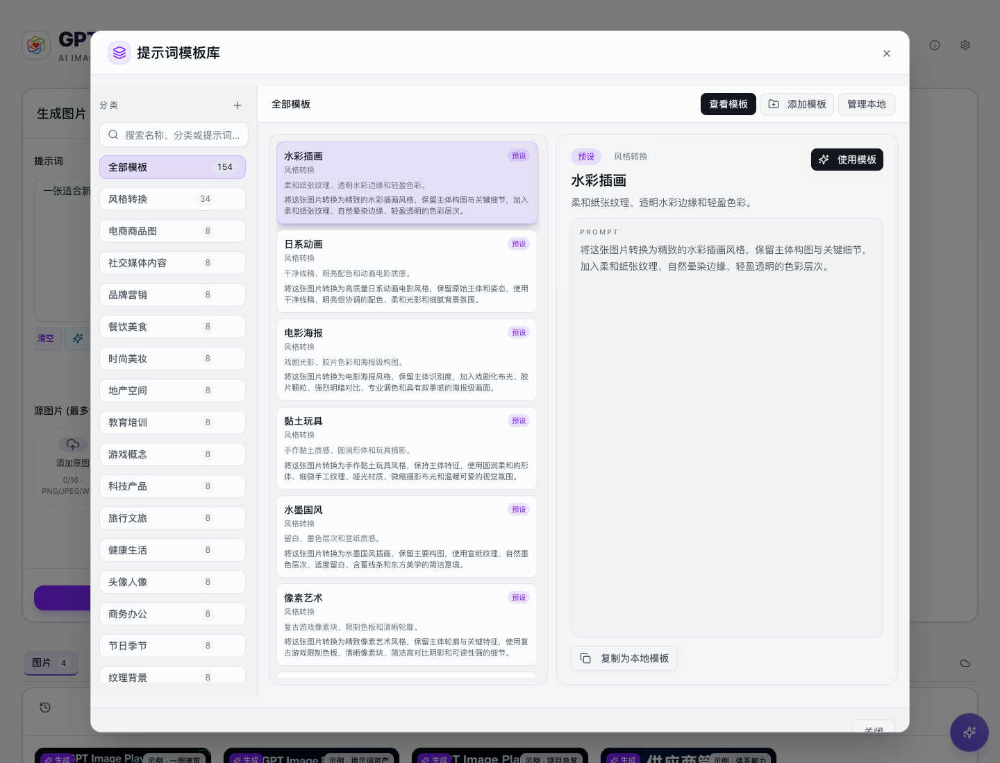
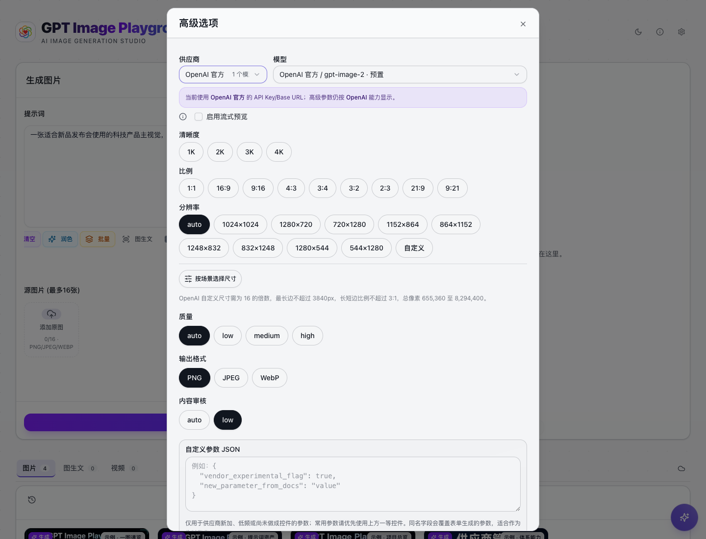
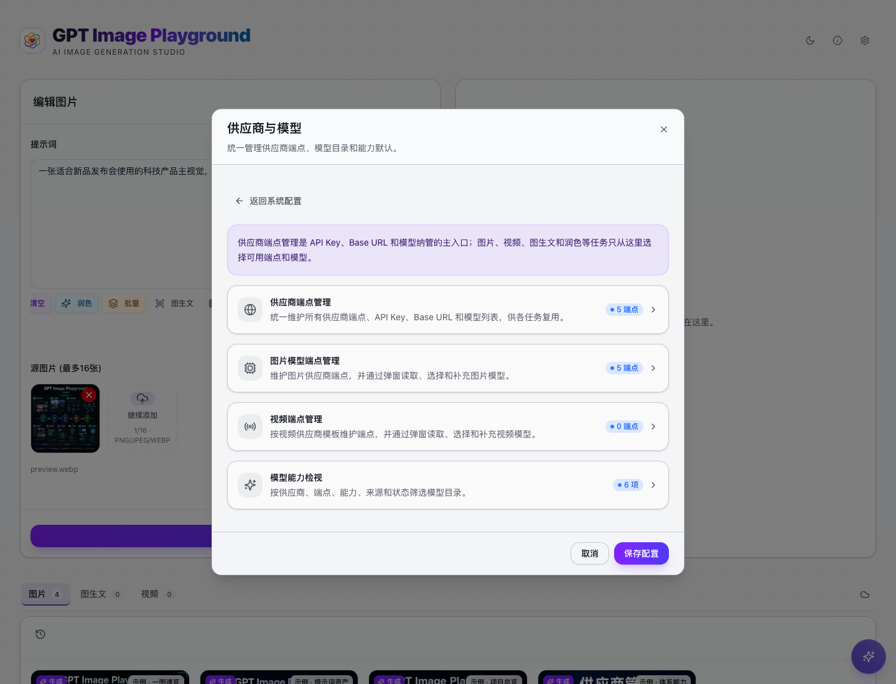
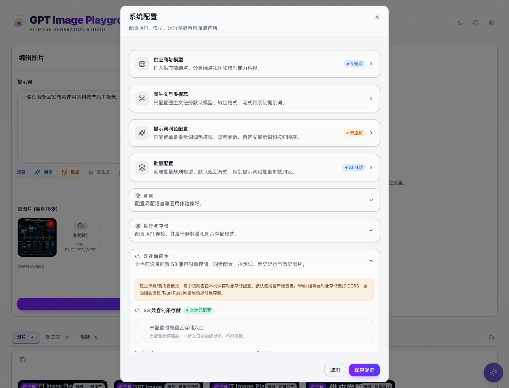

# GPT Image Playground 用户手册

这套文档从用户使用角度组织，不按源码模块组织。你可以把 GPT Image Playground 理解为一个 AI 图像生产工作台：先配置供应商，再围绕提示词、源图片、生成结果和历史资产持续迭代。

## 推荐阅读顺序

1. [快速开始](./getting-started.md)：第一次使用时，从配置 API 到生成第一张图。
2. [工作台界面说明](./workspace.md)：理解主界面的几个区域和常用交互。
3. [生成与编辑图片](./generation-editing.md)：掌握文生图、参考图编辑、蒙版和高级参数。
4. [提示词工作流](./prompt-workflow.md)：用模板、历史和润色提高产出效率。
5. [历史与资产管理](./history-and-assets.md)：复用、下载、筛选和继续编辑历史结果。
6. [供应商与系统设置](./providers-and-settings.md)：配置多端点、自定义模型、存储和运行参数。
7. [分享与云同步](./sharing-and-sync.md)：把工作流分享出去，或在多设备间恢复配置和历史。
8. [安装、部署与桌面端](./desktop-and-deployment.md)：本地运行、自托管、Vercel 和桌面端。
9. [展示内容与后台管理使用手册](./展示内容与后台管理使用手册.md)：管理展示位、展示组、展示素材和分享 Profile。

## 按场景阅读

- 想马上生成图片：读 [快速开始](./getting-started.md) 和 [生成与编辑图片](./generation-editing.md)。
- 想做商品图、封面和营销图：读 [提示词工作流](./prompt-workflow.md)，重点看模板库。
- 想把一张图反复改到满意：读 [生成与编辑图片](./generation-editing.md)，重点看参考图编辑和蒙版。
- 想管理大量结果：读 [历史与资产管理](./history-and-assets.md)。
- 想接入第三方中转或多个账号：读 [供应商与系统设置](./providers-and-settings.md)。
- 想把配置带到另一台电脑：读 [分享与云同步](./sharing-and-sync.md)。
- 想管理展示位、展示素材和分享展示内容：读 [展示内容与后台管理使用手册](./展示内容与后台管理使用手册.md)。

## 常用截图

| 功能         | 截图                                                  |
| ------------ | ----------------------------------------------------- |
| 主工作台     |           |
| 提示词模板库 |  |
| 高级选项     |             |
| 供应商设置   |         |
| 云同步       |            |
