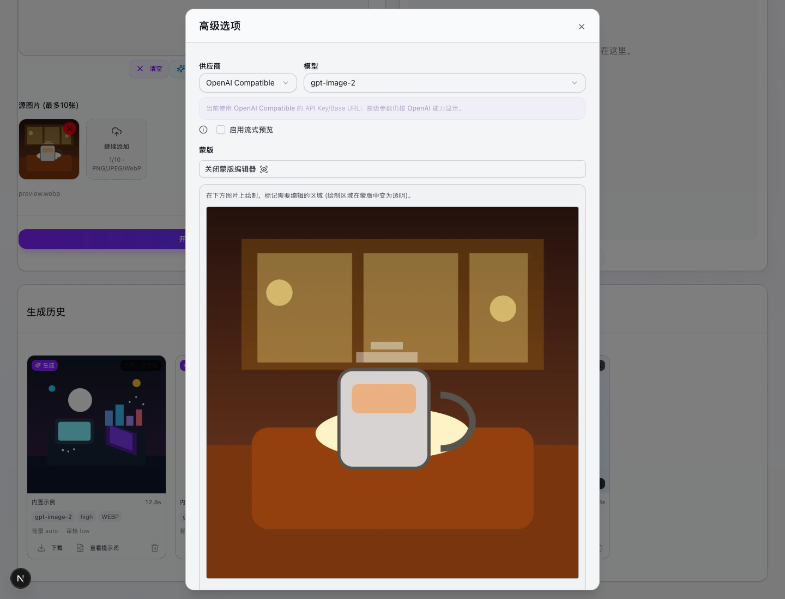
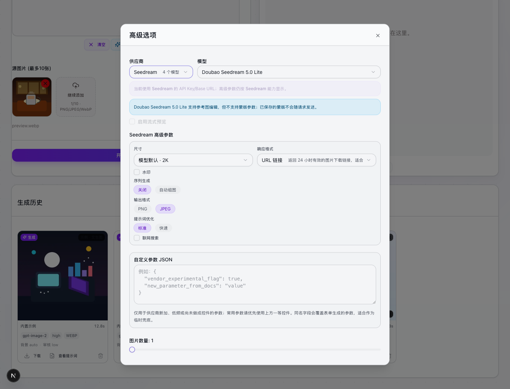

# 生成与编辑图片

GPT Image Playground 的核心工作流有两类：从文字生成图片，以及基于源图片继续编辑。两类工作流使用同一个提示词框和高级选项，只是是否添加源图片不同。

## 文生图

适合从零开始生成素材，例如商品主图、社媒封面、活动 KV、头像、场景概念图。

基本步骤：

1. 在提示词框描述画面。
2. 点击 **高级** 选择供应商和模型。
3. 设置图片数量、尺寸、质量和格式。
4. 点击 **开始生成**。
5. 在输出区查看结果，并把满意的图片下载或发送到编辑。

## 图片数量

图片数量可以设为 1-10 张。多图适合探索方向，单图适合最终输出。

流式预览只在支持的模型和单图生成时可用。数量大于 1 时，系统会自动关闭流式预览。

## 尺寸与质量

常见尺寸入口：

- **自动**：交给模型判断尺寸或比例。
- **纵向**：适合短视频封面、海报、手机壁纸。
- **横向**：适合官网首屏、横幅、发布会主视觉。
- **正方形**：适合头像、商品图、社交平台图片。
- **自定义**：在支持的模型上输入宽高。

`gpt-image-2` 支持自定义宽高。界面会校验边长、总像素、宽高比和 16 的倍数，避免提交无效尺寸。

## 输出格式

根据用途选择：

- **PNG**：适合保留透明背景或后期处理。
- **JPEG**：适合普通预览和较小体积。
- **WebP**：适合 Web 页面和批量素材。

当 JPEG 或 WebP 支持压缩控制时，会出现压缩率滑块。

## 参考图编辑

添加源图片后，输入区会自动切换为编辑图片模式。

适合这些场景：

- 给人物或商品添加元素。
- 改变图片风格。
- 替换背景或光影。
- 保留主体，调整构图和氛围。
- 多张参考图合成一个画面。

源图片最多 10 张。可以使用文件选择器，也可以拖拽或粘贴图片。

## 蒙版编辑

在支持蒙版的模型上，添加源图片后可以在高级选项里创建蒙版。

使用方式：

1. 添加源图片。
2. 点击 **高级 -> 蒙版 -> 创建蒙版**。
3. 在图片上绘制需要编辑的区域。
4. 调整笔刷大小。
5. 点击 **保存蒙版**。
6. 提交编辑任务。

你也可以上传已有 PNG 蒙版。上传的蒙版尺寸必须与源图片一致。

## Seedream 和 SenseNova 高级参数

不同供应商有自己的参数。应用会优先把常用参数做成界面控件，减少手写 JSON。

Seedream 常见参数包括：

- 尺寸和 2K/3K/4K 预设。
- 响应格式：URL 或 Base64 JSON。
- 水印。
- 序列生成和最大图片数。
- Seed、Guidance Scale。
- 输出格式。
- 提示词优化模式。
- 联网搜索。

SenseNova 会展示它支持的固定尺寸列表，例如 1:1、16:9、9:16、3:2、21:9 等。

## 自定义参数 JSON

高级选项底部有 **自定义参数 JSON**。它适合临时使用供应商新增、低频或尚未做成控件的参数。

建议：

- 常用参数优先使用界面控件。
- JSON 只作为临时兜底。
- 同名字段会覆盖界面生成的参数。
- 提交前界面会检查 JSON 是否有效。

## 继续编辑已有结果

你可以从三个地方把图片继续发送到编辑：

- 输出区的 **编辑** 按钮。
- 历史卡片预览。
- 全屏预览里的发送到编辑入口。

发送后页面会回到编辑区，并自动加载这张图片作为源图。
