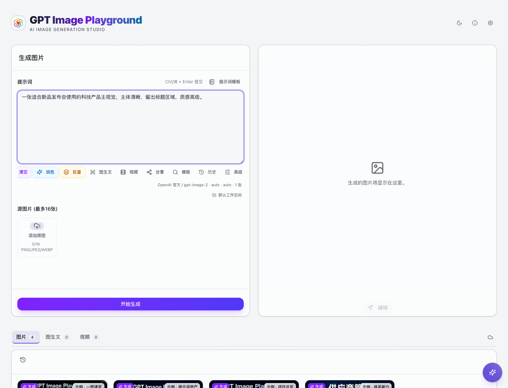
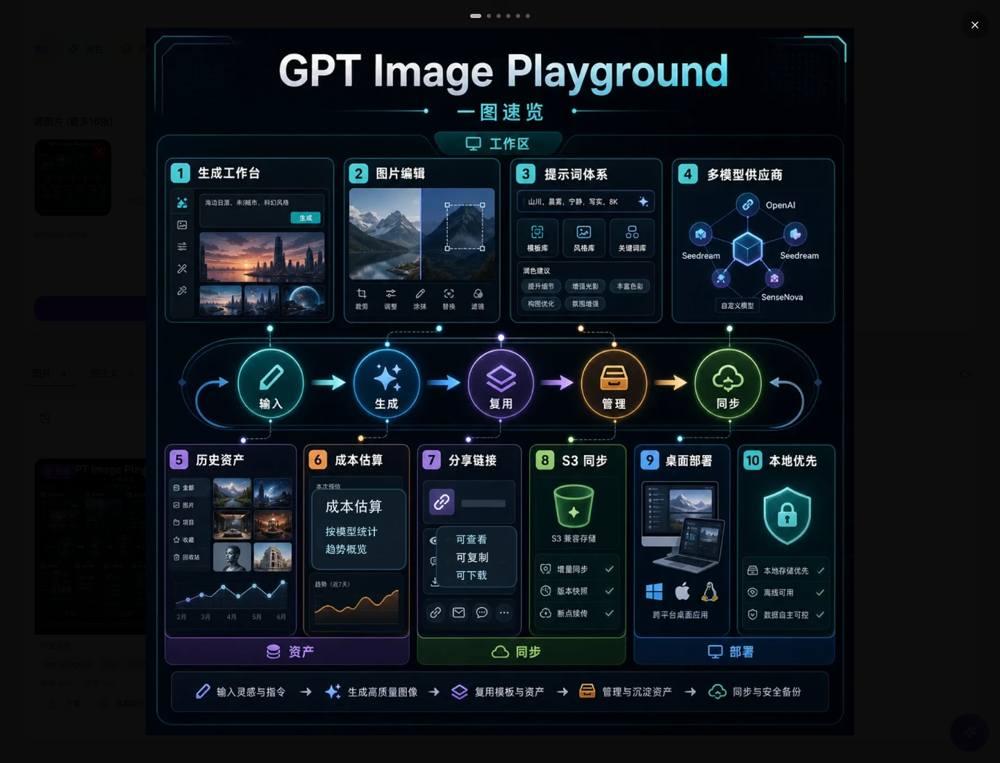
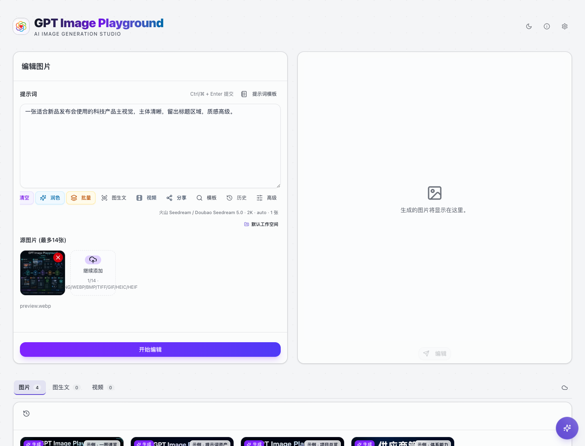

# 工作台界面说明

主界面由四个核心区域组成：顶部应用栏、左侧输入区、中间输出区、右侧历史区。它们共同形成“输入需求 -> 生成结果 -> 继续编辑 -> 沉淀历史”的工作流。

## 顶部应用栏

顶部展示应用名称，并提供几个全局入口：

- **主题切换**：在浅色/深色主题之间切换。
- **关于**：查看版本、项目地址、作者信息和更新检查。
- **Settings**：进入系统配置，包括供应商、提示词润色、存储、云同步和桌面端设置。

如果后台配置了页面顶部横幅，应用栏下方会展示该广告位；未配置、接口失败或图片加载失败时不会占用核心操作区域。

## 输入区

输入区默认是生成模式。只要添加源图片，就会自动变成编辑模式。

如果部署者配置了头部广告位，输入区标题右侧会显示赞助横幅；未配置时界面保持原样。

主要操作：

- 在提示词框描述你想要的图片。
- 点击 **提示词模板** 打开模板库。
- 点击 **润色**，让润色模型改写当前提示词。
- 点击 **分享**，生成可复用的配置链接；管理员提供分享广告 `Profile ID` 时，可以给链接关联公开的 `promoProfileId`。
- 点击 **模板** 或直接输入 `/`，快速搜索模板。
- 点击 **历史**，找回最近用过的提示词。
- 点击 **高级**，配置供应商、模型和图片参数。
- 上传、拖入或粘贴源图片，进入编辑图片流程。

常用快捷键：

- `Ctrl/⌘ + Enter`：提交生成或编辑任务。
- `/`：在提示词中唤起模板搜索。
- 全屏预览时 `Esc` 退出，左右方向键切换多图。

## 输出区

输出区显示当前任务的结果。

- 生成中会显示等待状态、耗时或流式预览。
- 多图结果支持网格视图和单图视图。
- 点击图片进入全屏预览。
- 单图视图下可以直接发送到编辑区。

## 历史区

历史区记录每一次生成或编辑。

如果后台配置了历史区横幅，历史列表上方会展示该广告位；广告异常时历史检索、预览和下载不受影响。

历史卡片会显示：

- 生成或编辑标识。
- 模型、质量、格式、背景、审核参数。
- 耗时和图片数量。
- 提示词入口。
- 下载入口。
- 费用估算入口。

历史为空时，应用会展示内置项目信息图，帮助你快速理解一图速览、工作台总览、提示词资产、供应商管理、历史资产和分享同步等能力。示例不会写入你的真实历史。

## 全局图片输入

编辑图片有三种常用入口：

- 点击 **添加原图** 选择文件。
- 从桌面拖拽图片到页面。
- 在页面任意位置粘贴剪贴板中的图片。

上传源图片后，按钮会变成 **开始编辑**。

## 任务队列

系统支持多个任务排队执行。并发数量可以在 **Settings -> 运行与存储** 中调整。

任务状态包括：

- 排队中。
- 处理中。
- 流式生成。
- 完成。
- 出错。
- 已取消。

生成中可以取消任务，失败任务可以关闭或重试。

## 桌面端广告读取

桌面端可以在 **Settings -> 桌面端设置 -> 广告读取** 中选择广告接口来源：

- `当前站点`：默认读取当前应用的 `/api/promo/placements`。
- `自定义域名`：填写广告服务域名，系统自动拼接读取接口。
- `完整接口`：直接填写完整广告读取接口。
- `关闭`：不请求广告接口，广告位保持隐藏。

广告请求失败、离线或超时时不会影响生成、编辑、历史和分享流程。
